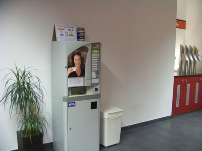
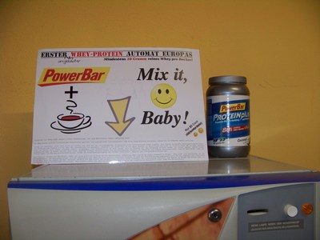
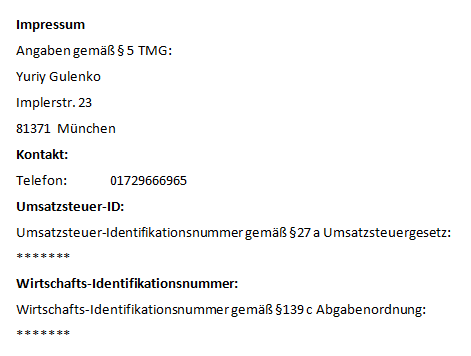


Lieber Besucher,

Sie wollen eine <b>kostenlose</b> Aufstellung von Automaten? Wir bieten professionellen Operating Service im Raum Muenchen!

Unsere Aufgabe ist das Aufstellen und die Wartung. Sie stellen lediglich den Stromanschluss und ihre Mitarbeiter, Kunden, Freunde bekommen zu einem unglaublichen Preis von <b>80 Cent</b> einen Cappuccino, Kaffee, Espresso, Milchkaffee, Tee, Suppe oder andere Leckereien!

Wir sind Ihr professioneller [Operating](http://www.gutefrage.net/frage/was-kostet-ein-getraenkeautomat-zum-aufstellen) Partner . Unser moderner, fitnessorientierter Kaffeeautomat macht verschiedene heisse Leckereien. Alle Automaten sind alle mit einem Wasserfiltersystem ausgestattet.

   
   

Bei Interesse schreiben Sie uns einfach an   
   <a href='&#109;ailt&#111;&#58;&#121;%&#55;&#53;&#46;gul%&#54;&#53;&#37;6&#69;&#107;o&#64;&#103;m&#97;%69%6C&#46;com'>y&#117;&#46;gulenk&#111;&#64;gmail&#46;com</a>
   
    
    